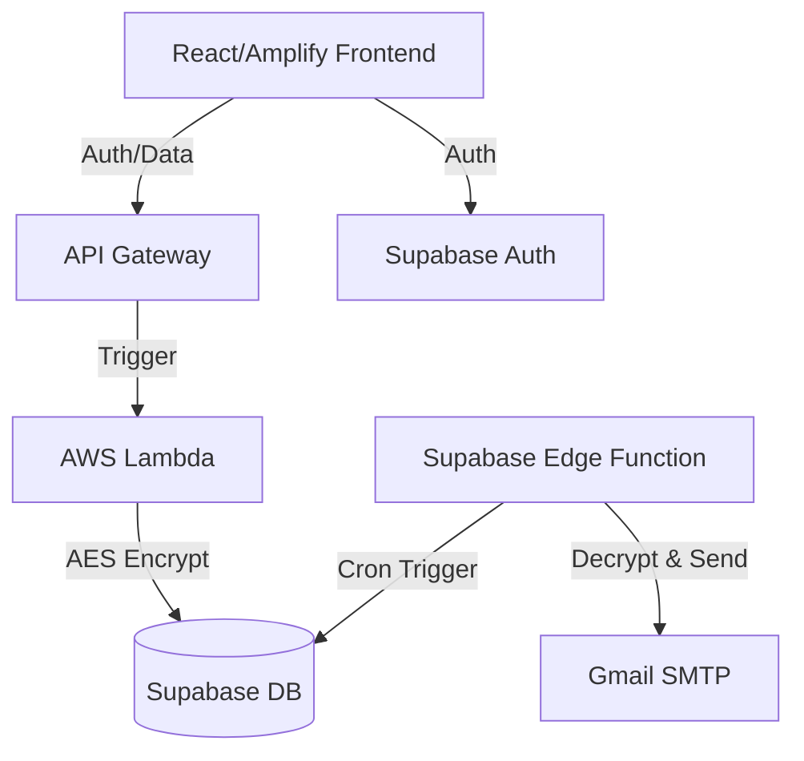

# Project Context: DearME 💌

**DearME** is an encrypted, time-locked messaging application that allows users to send messages to their future selves (or others) with a guaranteed delay.

## 🎯 Project Goal
To provide a secure and reliable platform for "digital time capsules." Users can write messages, pick a future date, and trust that the message remains unreadable and inaccessible until that date arrives.

## 🔐 Core Mechanism: Time-Locking & Encryption
The privacy of messages is protected through a dual-layer approach:

1.  **Application-Level Encryption**: Messages are encrypted using **AES-256 (Fernet)** on the backend before being stored. The `ENCRYPTION_KEY` is managed securely via AWS Lambda environment variables.
2.  **Status-Based Access**:
    *   **Scheduled**: The message content is encrypted in the database. The API returns `null` for the content, even if the user is authenticated, until the `scheduled_date` is reached.
    *   **Sent (Unlocked)**: Once the date passes, an automated worker updates the status to `sent`. Only then will the API decrypt and return the content to the authorized recipient.

## 🛠️ Tech Stack

### Frontend
- **Framework**: React 19 (Vite)
- **Deployment**: **AWS Amplify Hosting** (Monorepo configuration)
- **Styling**: Vanilla CSS + Premium Animations
- **Connectivity**: Fail-safe API detection (Auto-switches to AWS Production URL)

### Backend
- **Framework**: FastAPI (Python 3.11)
- **Runtime**: **AWS Lambda** (512MB RAM, 30s Timeout) + **Mangum**
- **Security**: Cryptography (Fernet), PyJWT, Supabase Auth

### Infrastructure (IaC)
- **Provisioning**: **Terraform** ("Pure" Infrastructure as Code)
- **API Management**: **AWS API Gateway** (HTTP API)
- **Secrets**: AWS SSM Parameter Store

## 🏗️ Architecture Overview

## 🚀 Deployment Status
- [x] Backend API core logic (FastAPI)
- [x] AWS Lambda Migration & Stabilization (512MB RAM)
- [x] AWS API Gateway Integration
- [x] AWS Amplify Frontend Deployment
- [x] Terraform Infrastructure Automation
- [x] Automated delivery worker (Edge Function)

## 📂 Key Components
- **Lambda API**: Handles message creation, encryption, and secure retrieval with custom Windows-compatible packaging.
- **Amplify Frontend**: A premium, responsive interface with SPA routing and environment-aware API configuration.
- **Vault**: A secure archive for viewing history of scheduled and received messages.

