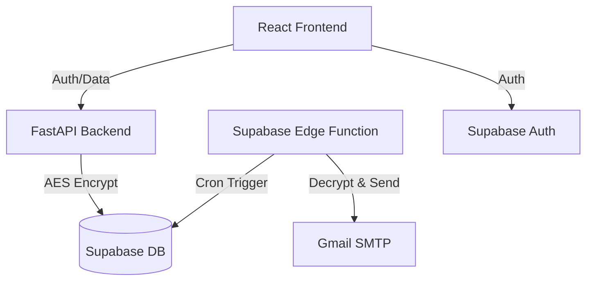

# Project Context: DearME 💌

**DearME** is an encrypted, time-locked messaging application that allows users to send messages to their future selves (or others) with a guaranteed delay.

## 🎯 Project Goal
To provide a secure and reliable platform for "digital time capsules." Users can write messages, pick a future date, and trust that the message remains unreadable and inaccessible until that date arrives.

## 🔐 Core Mechanism: Time-Locking & Encryption
The privacy of messages is protected through a dual-layer approach:

1.  **Application-Level Encryption**: Messages are encrypted using **AES-256 (Fernet)** on the backend before being stored. The `ENCRYPTION_KEY` is managed as a secure environment variable.
2.  **Status-Based Access**:
    *   **Scheduled**: The message content is encrypted in the database. The API returns `null` for the content, even if the user is authenticated, until the `scheduled_date` is reached.
    *   **Sent (Unlocked)**: Once the date passes, an automated worker updates the status to `sent`. Only then will the API decrypt and return the content to the authorized recipient.

## 🛠️ Tech Stack

### Frontend
- **Framework**: React 19 (Vite)
- **Routing**: React Router 7
- **Styling**: Tailwind CSS + Framer Motion (for premium animations)
- **State Management**: React Context (Auth)
- **Icons**: Lucide React

### Backend
- **Framework**: FastAPI (Python 3.9+)
- **Security**: Cryptography (Fernet), PyJWT, Supabase Auth
- **Server**: Uvicorn

### Database & Infrastructure
- **Provider**: Supabase (PostgreSQL)
- **Auth**: Supabase Auth
- **Worker**: Supabase Edge Functions (Deno) for scheduled message delivery.

## 🏗️ Architecture Overview

## 📂 Key Components
- **Backend API**: Handles message creation, encryption, and secure retrieval.
- **Supabase Edge Function**: Periodically checks for matured messages and "unlocks" them.
- **Vault (Frontend)**: A secure archive where users can see their history of scheduled and received messages.

## 🚀 Current Status
- [x] Backend API core logic (FastAPI)
- [x] Frontend Dashboard & Vault (React)
- [x] Supabase integration (DB & Auth)
- [x] Automated delivery worker (Edge Function)
- [/] **AWS Migration Research** (In Progress)

## ☁️ Future AWS Architecture (Proposed)
The project is currently evaluating a migration to AWS for enhanced control and potentially lower costs:
- **Compute**: AWS App Runner (API) + AWS Lambda (Workers)
- **Database**: Amazon RDS (PostgreSQL)
- **Frontend**: AWS Amplify or S3+CloudFront
- **Secrets**: AWS Secrets Manager
